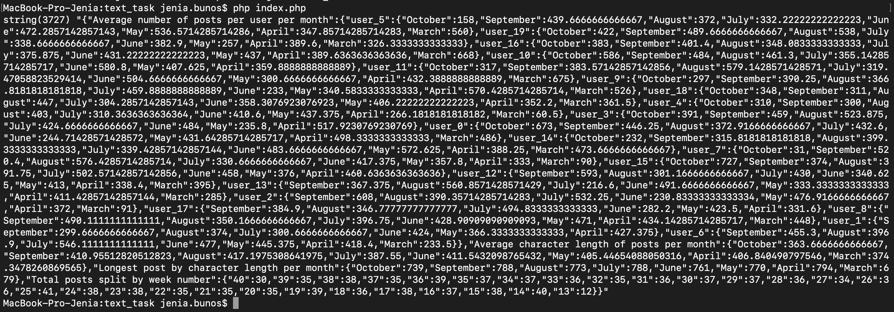
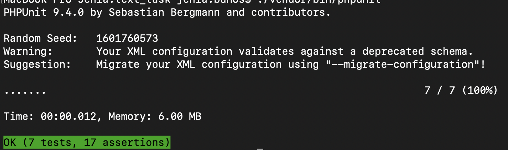

## Supermetrics Test Task

Test task for fetching and manipulating JSON data from a fictional Supermetrics Social Network REST API.

### Project Setup
#### Clone repo
```
git clone https://github.com/BunosJenia/Supermetrics.git
```

#### Install dependencies
```
composer install
```

#### Set config
- Add `client_id`, `email`, `name` to `SUPERMETRICS_API_CLIENT_ID`, `SUPERMETRICS_API_EMAIL`, `SUPERMETRICS_API_NAME` in `/src/config/config.php`


### Run Project
####  Run Command in console
```
php index.php
```

### Run PHPUnit Tests
####  Run Command
```
./vendor/bin/phpunit
```

#### Response example
```
{"Average number of posts per user per month":{"user_5":{"October":158,"September":439.6666666666667,"August":372,"July":332.22222222222223,"June":472.2857142857143,"May":536.5714285714286,"April":347.85714285714283,"March":560},"user_19":{"October":422,"September":489.6666666666667,"August":538,"July":338.6666666666667,"June":382.9,"May":257,"April":389.6,"March":326.3333333333333},"user_16":{"October":383,"September":401.4,"August":348.0833333333333,"July":375.875,"June":431.22222222222223,"May":437,"April":389.6363636363636,"March":668},"user_10":{"October":586,"September":484,"August":461.3,"July":355.14285714285717,"June":580.8,"May":407.625,"April":359.8888888888889},"user_11":{"October":317,"September":383.57142857142856,"August":579.1428571428571,"July":319.47058823529414,"June":504.6666666666667,"May":300.6666666666667,"April":432.3888888888889,"March":675},"user_9":{"October":297,"September":390.25,"August":366.8181818181818,"July":459.8888888888889,"June":233,"May":340.5833333333333,"April":570.4285714285714,"March":526},"user_18":{"October":348,"September":311,"August":447,"July":304.2857142857143,"June":358.3076923076923,"May":406.22222222222223,"April":352.2,"March":361.5},"user_4":{"October":310,"September":300,"August":403,"July":310.3636363636364,"June":410.6,"May":437.375,"April":266.1818181818182,"March":60.5},"user_3":{"October":391,"September":459,"August":523.875,"July":424.6666666666667,"June":484,"May":235.8,"April":517.9230769230769},"user_0":{"October":673,"September":446.25,"August":372.9166666666667,"July":432.6,"June":244.71428571428572,"May":431.64285714285717,"April":498.3333333333333,"March":486},"user_14":{"October":232,"September":315.8181818181818,"August":399.3333333333333,"July":339.42857142857144,"June":483.6666666666667,"May":572.625,"April":388.25,"March":473.6666666666667},"user_7":{"October":31,"September":520.4,"August":576.4285714285714,"July":330.6666666666667,"June":417.375,"May":357.8,"April":333,"March":90},"user_15":{"October":727,"September":374,"August":391.75,"July":502.57142857142856,"June":458,"May":376,"April":460.6363636363636},"user_12":{"September":593,"August":301.1666666666667,"July":430,"June":340.625,"May":413,"April":338.4,"March":395},"user_13":{"September":367.375,"August":560.8571428571429,"July":216.6,"June":491.6666666666667,"May":333.3333333333333,"April":411.42857142857144,"March":285},"user_2":{"September":608,"August":390.35714285714283,"July":532.25,"June":230.83333333333334,"May":476.9166666666667,"April":372,"March":91},"user_17":{"September":384.9,"August":346.77777777777777,"July":494.8333333333333,"June":282.2,"May":423.5,"April":331.6},"user_8":{"September":490.1111111111111,"August":350.1666666666667,"July":396.75,"June":428.90909090909093,"May":471,"April":434.14285714285717,"March":448},"user_1":{"September":299.6666666666667,"August":374,"July":300.6666666666667,"June":424,"May":366.3333333333333,"April":427.375},"user_6":{"September":455.3,"August":396.9,"July":546.1111111111111,"June":477,"May":445.375,"April":418.4,"March":233.5}},"Average character length of posts per month":{"October":363.6666666666667,"September":410.95512820512823,"August":417.1975308641975,"July":387.55,"June":411.5432098765432,"May":405.44654088050316,"April":406.840490797546,"March":374.3478260869565},"Longest post by character length per month":{"October":739,"September":788,"August":773,"July":788,"June":761,"May":770,"April":794,"March":679},"Total posts split by week number":{"40":30,"39":35,"38":38,"37":35,"36":39,"35":37,"34":37,"33":36,"32":35,"31":36,"30":37,"29":37,"28":36,"27":34,"26":36,"25":41,"24":38,"23":38,"22":35,"21":35,"20":35,"19":39,"18":36,"17":38,"16":37,"15":38,"14":40,"13":12}}
```

#### Examples of running commands
> php index.php



> ./vendor/bin/phpunit

